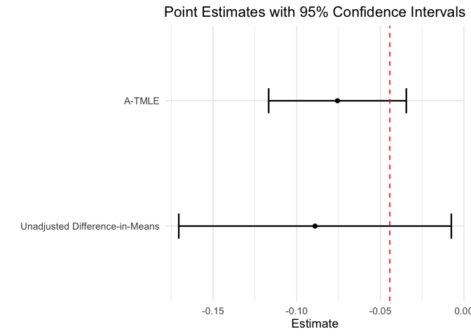

<!-- README.md is generated from README.Rmd. Please edit that file -->

# `atmle`: Adaptive TMLE for RCT + RWD Data Fusion

<!-- badges: start -->

[](https://opensource.org/licenses/MIT)
<!-- badges: end -->

This package implements adaptive targeted minimum loss-based estimation
of average treatment effects using combined randomized trial and
real-world data to improve efficiency.

**Authors:** [Sky Qiu](https://github.com/tq21), Jens Tarp, [Lars van
der Laan](https://larsvanderlaan.github.io/), [Mark van der
Laan](https://vanderlaan-lab.org/),

------------------------------------------------------------------------

## Issues

If you encounter any bugs or have any specific feature requests, please
[file an issue](https://github.com/tq21/atmle/issues).

------------------------------------------------------------------------

## Example

``` r
library(atmle)
library(sl3)
library(ggplot2)

set.seed(2026)
data <- readRDS("data/example_data.RDS")
true_ate <- -0.04429033
W_nodes <- names(data)[!(names(data) %in% c("Y", "A", "S"))]

# unadjusted trial-only difference-in-means
rct <- data[data$S == 1, ]
diff_est <- with(rct, mean(Y[A == 1])-mean(Y[A == 0]))
diff_se <- sqrt(with(rct,
                     var(Y[A == 1])/sum(A == 1)+var(Y[A == 0])/sum(A == 0)))
diff_ci <- diff_est + c(-1, 1) * qnorm(0.975) * diff_se

# A-TMLE
lrnr <- list(
  learners = list(
    sl3::Lrnr_glm$new(),
    sl3::Lrnr_earth$new(),
    sl3::Lrnr_gam$new()
  ),
  metalearner = sl3::Lrnr_cv_selector$new(sl3::loss_loglik_binomial)
)
fit <- atmle_ate_fusion$new(
  data = data,
  S_node = "S",
  W_nodes = W_nodes,
  A_node = "A",
  Y_node = "Y",
  family = "binomial",
  n_folds = 3
)

fit$run(
  g_bar_method = lrnr,
  theta_method = lrnr,
  Pi_method = lrnr,
  Q_bar_method = lrnr,
  A_cate_args = list(max_degree = 3L, smoothness_orders = 1L, num_knots = 5L),
  S_cate_args = list(max_degree = 3L, smoothness_orders = 1L, num_knots = 5L),
  target_method = "tmle",
  target_gwt = FALSE,
  max_iter = 10,
  verbose = FALSE
)
```

``` r
atmle_res <- fit$results[fit$results$param == "Avg. over S=1", ]
df_plot <- data.frame(Estimator = c("Unadjusted Difference-in-Means",
                                    "A-TMLE"),
                      Estimate = c(diff_est, atmle_res$psi),
                      Lower = c(diff_ci[1], atmle_res$lower),
                      Upper = c(diff_ci[2], atmle_res$upper))
df_plot$Estimator <- factor(df_plot$Estimator, 
                            levels = c("Unadjusted Difference-in-Means",
                                       "A-TMLE"))
ggplot(df_plot, aes(x = Estimator, y = Estimate, fill = Estimator)) +
  geom_point() +
  geom_errorbar(aes(ymin = Lower, ymax = Upper), width = 0.2, linewidth = 0.8) +
  geom_hline(yintercept = true_ate, linetype = "dashed", color = "red") +
  theme_minimal(base_size = 13) +
  labs(title = "Point Estimates with 95% Confidence Intervals",
       y = "Estimate",
       x = "") +
  theme(legend.position = "none",
        plot.title = element_text(hjust = 0.5)) +
  coord_flip()
```

<!-- -->

## License

© 2026 [Sky Qiu](https://github.com/tq21), Jens Tarp, [Lars van der
Laan](https://larsvanderlaan.github.io/), [Mark van der
Laan](https://vanderlaan-lab.org/),

The contents of this repository are distributed under the MIT license.
